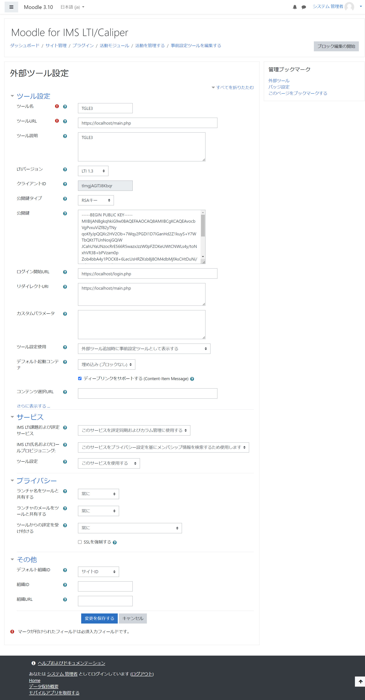
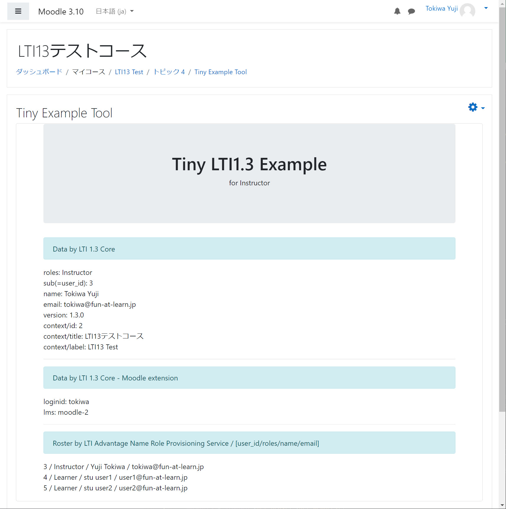
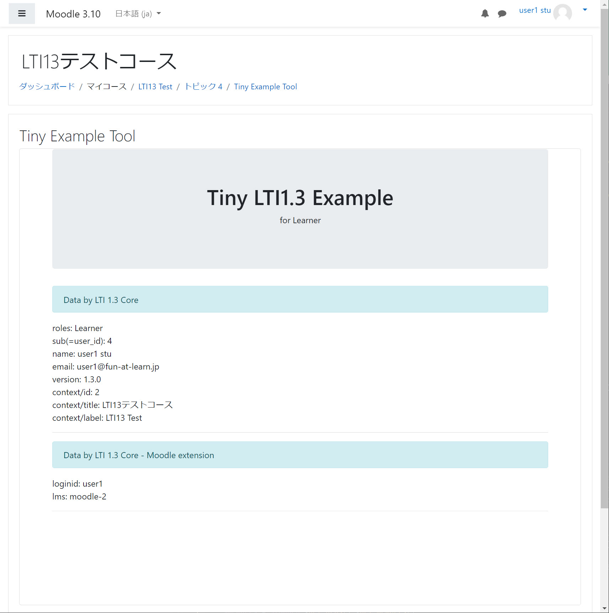

# lti13-php-tiny-example-tool

## 概要

このサンプルToolは、大学での利用を想定したツールテンプレートです。PlatformであるLMSから起動されたToolはLTI1.
3にて接続が確立され、ToolがPlatformからIDトークンを受け取った後にmai.phpを実行します。main.
phpではユーザのroleを参照して、教員あるいは学生用のコードにredirectされます、そしてそれぞれの初期画面を表示します。
この事例では、 LTI1.3の次の機能が実装されています。
- LTI1.3 Tool Core
- LTI Advantage
  - LTI1.3 NRPS (Names and Role Provisioning Services)

## Platform環境

LTI1.3 Toolを実行するためには LTI1.3 および LTI Advantage を実装したPlatform が必要となりますが、Moodleを前提としています。 
MoodleはOpen Source Softwareですので、AWS等で構築することができます。LTI1.3はPlatformとTool間がTLS1.
2を前提としておりSSL証明書の設定が必要です。
また、日本IMS協会ではテスト用のMoodleを下記のURLにて構築しています。

https://www.imsjapan.org/moodle/ (2021.xx公開予定)

## 実行環境

Toolの実行は、開発を行なうローカルPCでWebサーバを稼働させる方法と、AWSのようなクラウドでサーバを稼働させる方法があります。いずれの方法でもCORS 問題への対応にためPHP 7.3 
以上が必要となります。
そのためには XAMPPを利用することが最も簡便で下記の環境での稼働を確認しています。

**ローカルPC**
- Windows 10 + xampp-windows-x64-7.3.23-0-VC15

**AWSで提供されるサーバ** 
- AWS Linux2 + xampp-linux-x64-7.3.23-0-installer.run

XAMPPについては実行時にNoticeレベルのエラーが生じXMLHttpRequestでやり取りされるコードがエラーを引き起こすため、php.ini において下記を設定してください。

```
error_reporting=E_ALL & ~E_NOTICE
```

- https化。LTI1.3
  はPlatformとTool間がTSL1.2で保証されていることが前提となりますので自己証明書によるSSL化します。localhostのSSL化の情報は多々存在しますが、下記が参考になります。
  https://qiita.com/sutara79/items/21a068494bc3a08a4803
- DocumentRootの設定はxampp/apache/conf/extra/httpd-ssl.conf を下記を参照してください。Document Root は git
  cloneして生成されるフォルダーとなります。

```
##### Listen is Required for LTI13
Listen 443

SSLCipherSuite HIGH:MEDIUM:!MD5:!RC4:!3DES
SSLProxyCipherSuite HIGH:MEDIUM:!MD5:!RC4:!3DES

SSLHonorCipherOrder on 

SSLProtocol all -SSLv3
SSLProxyProtocol all -SSLv3

SSLPassPhraseDialog  builtin

SSLSessionCache "shmcb:D:/xampp/apache/logs/ssl_scache(512000)"
SSLSessionCacheTimeout  300

<VirtualHost _default_:443>
#########DocumentRoot "D:/xampp/htdocs"

DocumentRoot "G:/lti13-php-tiny-example-tool"

<Directory "G:/lti13-php-tiny-example-tool">
    Options Indexes FollowSymLinks Includes ExecCGI
    AllowOverride All
    Require all granted
</Directory>

####ServerName localhost:443
####ServerAdmin admin@example.com
ErrorLog "D:/xampp/apache/logs/error.log"
TransferLog "D:/xampp/apache/logs/access.log"

SSLEngine on

SSLCertificateFile "conf/my-localhost.crt"
SSLCertificateKeyFile "conf/my-localhost.key"

<FilesMatch "\.(cgi|shtml|phtml|php)$">
    SSLOptions +StdEnvVars
</FilesMatch>
<Directory "D:/xampp/apache/cgi-bin">
    SSLOptions +StdEnvVars
</Directory>

BrowserMatch "MSIE [2-5]" \
         nokeepalive ssl-unclean-shutdown \
         downgrade-1.0 force-response-1.0

CustomLog "D:/xampp/apache/logs/ssl_request.log" \
          "%t %h %{SSL_PROTOCOL}x %{SSL_CIPHER}x \"%r\" %b"

</VirtualHost>       
```

## Moodleにおける設定

管理者権限で外部ツールを設定します。コースを担当する教員はそれを「活動もしくはリソースを追加する」にて担当するコースに設置します。



## Toolにおける設定

1. {サンプルプログラムを展開したディレクトリ} にて下記を実行します。vendor　ディレクトリが新規に作成され、そこにIMS LTI Library がインストールされます。
```
    composer.phar install
```
2. Moodleで外部ツールを設定したときに提供された情報を db/config/local.json に追加します。
なお、private_key_file はTool用に生成した秘密鍵を指定し、公開鍵は上述したMoodleにおける外部ツールの設定にて指定します。日本IMS協会で提供するMoodle
を使う場合には、このサンプルプログラムで使っているTool_Pri.keyをそのまま使ってください。
```
    "https://c3.yujitokiwa.jp/moodle": {
        "client_id": "C1I9mztu7D1zL5o",
        "auth_login_url": "https://c3.yujitokiwa.jp/moodle/mod/lti/auth.php",
        "auth_token_url": "https://c3.yujitokiwa.jp/moodle/mod/lti/token.php",
        "key_set_url": "https://c3.yujitokiwa.jp/moodle/mod/lti/certs.php",
        "private_key_file": "/Tool_Pri.key",
        "deployment": [
            "1"
        ]
    },
```
3. 自己証明書などによってSSL化したhttpdサーバーにおいて、DocumentRootは{サンプルプログラムを展開したディレクトリ} で設定してください。

## Platformからの起動

次の手順でPlatformからToolを起動します。

1. XAMPPを起動します。これで Tool はPlatformからの起動待ちとなります。
1. Moodleにログインして、コースに配置されたLTIツールのリンクをクリックします。
1. ユーザのロールにより教員画面あるいは学生画面が表示されます。




## デバッグ

設定すべきパラメータが多いため、多くの場合、設定後の接続テスト直後の起動は成功しない。確認すべきことは多々あるので、代表的な確認項目を列挙する。

1. https://localhost/imsjtool.php で、login.phpやgame.phpのディレクトリにアクセスできることを確認します。
1. local.json において、同一のPlatformを異なるdeploymentナンバーで複数設定するとエラーが生じるので、不要なエントリは削除してください。
1. Moodleの外部ツールの設定はデフォルトから変更されていることを確認します。
1. xdebugを導入し、PhpStormなどでBreakpointを設定してデバッグします。PhpStormはアカデミックユーザの場合、所定の手続きをすれば無償で利用できます。
1. ブラウザがFirefoxでかつPCでToolを稼働させる場合、ブラウザーオプションの証明書マネージャーにてlocalhost:443のサーバ証明書のエラー例外を設定していることを確認します。


