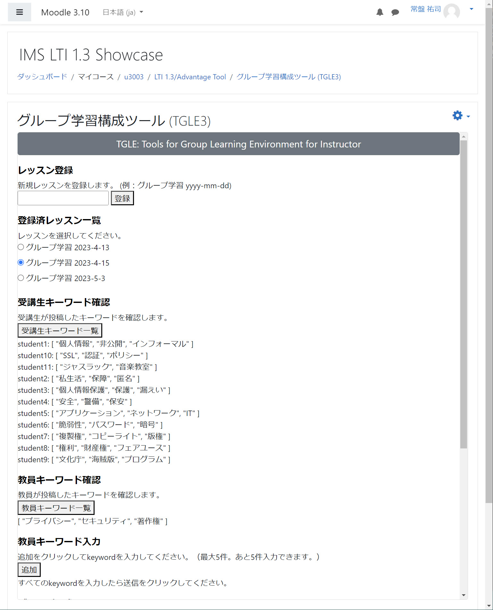

# TGLE Front End

## 概要

フロントエンドは、LMSとLTI 1.3 
により連携し、教員と学生用のインターフェースを提供します。教員向けには、グループ学習のレッスン登録、そのレッスンで行う学習テーマに即した複数のキーワードの入力、グループ形成の実行、といった機能を実装しています。一方、学生向けには、教員が設定したグループ学習のレッスンの選択、そレッスンで議論したいテーマに関連した複数のキーワードの入力、設定されたグループとグループメンバの確認、といった機能を実装しています。1EdTechから提供されるPHP版LTI 1.3を前提とするためプログラミング言語はPHPとし、ユーザインターフェースはJavaScriptおよびVueフレームワークを用いています。
- LTI1.3 Tool Core
- LTI Advantage
  - LTI1.3 NRPS (Names and Role Provisioning Services)

## Platform環境

LTI1.3 Toolと接続するPlatformは LTI1.3 および LTI Advantage を実装している必要があります。ここでは、Moodle3.10以上および4.0以上を前提としています。

## 実行環境

Toolの実行は、開発を行なうローカルPCでWebサーバを稼働させる方法と、AWSのようなクラウドでサーバを稼働させる方法があります。いずれの方法でもCORS 問題への対応のためPHP 7.3 
以上が必要となりますが、XAMPPを利用することが最も簡便です。下記のパッケージでの稼働を確認しています。

**ローカルPC**
- Windows 10 + xampp-windows-x64-7.3.23-0-VC15

XAMPPについては実行時にNoticeレベルのエラーが生じるとXMLHttpRequestでやり取りされるコードがエラーを引き起こすため、php.ini において下記を設定してください。

```
error_reporting=E_ALL & ~E_NOTICE
```

- https化
  
  LTI1.3はPlatformとTool間がTSL1.2で保証されていることが前提となりますので自己証明書によるSSL化します。localhostのSSL化の情報は多々存在しますが、下記が参考になります。
  
  https://qiita.com/sutara79/items/21a068494bc3a08a4803
  
- DocumentRootの設定
  
httpd.confではなくxampp/apache/conf/extra/httpd-ssl.conf にて設定します。
下記を参照して設定してください。Document Root は git 
cloneで作成されるフォルダーとなります。

```
##### Listen is Required for LTI13
Listen 443

SSLCipherSuite HIGH:MEDIUM:!MD5:!RC4:!3DES
SSLProxyCipherSuite HIGH:MEDIUM:!MD5:!RC4:!3DES

SSLHonorCipherOrder on 

SSLProtocol all -SSLv3
SSLProxyProtocol all -SSLv3

SSLPassPhraseDialog  builtin

SSLSessionCache "shmcb:D:/xampp1/apache/logs/ssl_scache(512000)"
SSLSessionCacheTimeout  300

<VirtualHost _default_:443>
#########DocumentRoot "D:/xampp1/htdocs"

# Document Root for LTI13 is specified in this instead of httpd.conf
# DocumentRoot "G:/tgle3fe"
DocumentRoot "D:/tgle/fe"

<Directory "D:/tgle/fe">
    Options Indexes FollowSymLinks Includes ExecCGI
    AllowOverride All
    Require all granted
</Directory>

####ServerName localhost:443
####ServerAdmin admin@example.com
ErrorLog "D:/xampp1/apache/logs/error.log"
TransferLog "D:/xampp1/apache/logs/access.log"

SSLEngine on

SSLCertificateFile "conf/my-server.crt"
SSLCertificateKeyFile "conf/my-server.key"

<FilesMatch "\.(cgi|shtml|phtml|php)$">
    SSLOptions +StdEnvVars
</FilesMatch>
<Directory "D:/xampp1/apache/cgi-bin">
    SSLOptions +StdEnvVars
</Directory>

BrowserMatch "MSIE [2-5]" \
         nokeepalive ssl-unclean-shutdown \
         downgrade-1.0 force-response-1.0

CustomLog "D:/xampp1/apache/logs/ssl_request.log" \
          "%t %h %{SSL_PROTOCOL}x %{SSL_CIPHER}x \"%r\" %b"

</VirtualHost>     
```

## Moodleにおける設定

管理者権限で外部ツールを設定します。コースを担当する教員はそれを「活動もしくはリソースを追加する」にて担当するコースに設置します。


## Toolにおける設定

1. {サンプルプログラムを展開したディレクトリ} にて下記を実行します。vendor　ディレクトリが新規に作成され、そこにIMS LTI1.3 Library がインストールされます。
```
    composer.phar install
```
2. Moodleで外部ツールを設定したときに提供された情報を db/config/local.json に追加します。
なお、private_key_file はTool用に生成した秘密鍵を指定し、公開鍵は上述したMoodleにおける外部ツールの設定にて指定します。日本IMS協会で提供するMoodle
を使う場合には、このサンプルプログラムで使っているTool_Pri.keyをそのまま使ってください。
```
    "https://c3.yujitokiwa.jp/moodle": {
        "client_id": "C1I9mztu7D1zL5o",
        "auth_login_url": "https://c3.yujitokiwa.jp/moodle/mod/lti/auth.php",
        "auth_token_url": "https://c3.yujitokiwa.jp/moodle/mod/lti/token.php",
        "key_set_url": "https://c3.yujitokiwa.jp/moodle/mod/lti/certs.php",
        "private_key_file": "/Tool_Pri.key",
        "deployment": [
            "1"
        ]
    },
```
3. 自己証明書などによってSSL化したhttpdサーバーにおいて、DocumentRootは{サンプルプログラムを展開したディレクトリ} で設定してください。

## Platformからの起動

次の手順でPlatformからToolを起動します。

1. XAMPPを起動します。これで Tool はPlatformからの起動待ちとなります。
1. Moodleにログインして、コースに配置されたLTIツールのリンクをクリックします。
1. ユーザのロールにより教員画面あるいは学生画面が表示されます。

### Instructor画面


### Learner画面


## デバッグ

設定すべきパラメータが多いため、多くの場合、設定後の接続テスト直後の起動は成功しない。確認すべきことは多々あるので、代表的な確認項目を列挙する。

1. https://localhost/imsjtool.php で、login.phpやgame.phpのディレクトリにアクセスできることを確認します。
1. local.json において、同一のPlatformを異なるdeploymentナンバーで複数設定するとエラーが生じるので、不要なエントリは削除してください。
1. Moodleの外部ツールの設定はデフォルトから変更されていることを確認します。
1. xdebugを導入し、PhpStormなどでBreakpointを設定してデバッグします。PhpStormはアカデミックユーザの場合、所定の手続きをすれば無償で利用できます。
1. ブラウザがFirefoxでかつPCでToolを稼働させる場合、ブラウザーオプションの証明書マネージャーにてlocalhost:443のサーバ証明書のエラー例外を設定していることを確認します。


